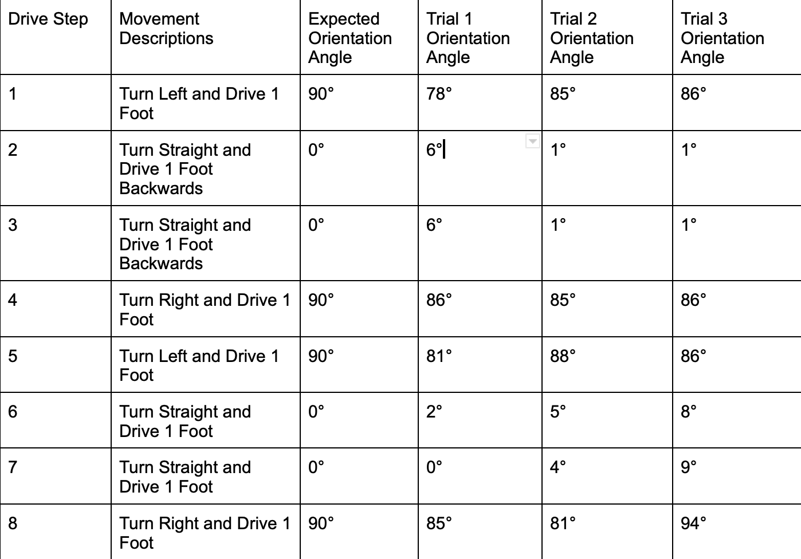
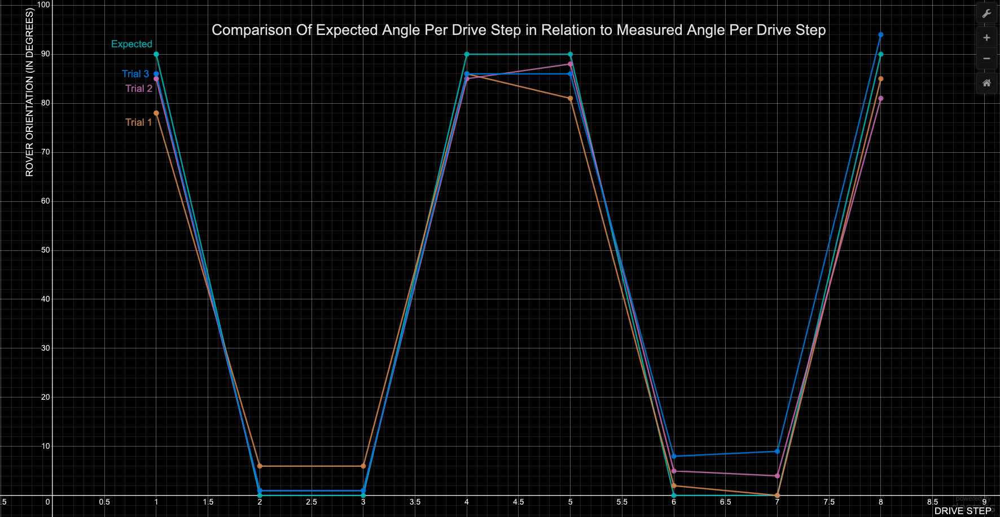

## :robot:Developing An Autonomous Reconnaissance Robot To Navigate Indoor Spaces Using 2D LiDAR Based SLAM:robot:

## Group Members
Kesler Mathieu, Hung Tran, Ameera Zamani Iftekhar, Maggie Lau

## Type of Project
Engineering - Graduate Level <br>
[Full Report](Autonomous_Indoor_Rover_Report.pdf)

## Summary
The goal at hand is to create a rover that can be deployed in an unknown indoor environment, autonomously navigate while capturing video feed, and subsequently return to its starting position. The central technique known as SLAM will allow the rover to concurrently map and locate itself in a newfound floorspace. This will subsequently be paired with path planning algorithms so the vehicle can efficiently navigate such space while avoiding collisions, henceforth achieving a level of autonomy sufficient enough for indoor exploration. 

## Introduction
In certain hostile environments, first responders have to navigate through unknown zones that can lead to their demise if the area isn’t canvassed beforehand. To provide some context, first responders scenarios can range from police officers trying to deescalate hostage situations to firefighters performing disaster relief efforts after the onset of a hurricane and even military personnel commandeering battlefield strongholds from enemy possession. According to the [National Institute of Science and Technology](https://nvlpubs.nist.gov/nistpubs/TechnicalNotes/NIST.TN.1648.pdf), over 83,000 firefighter related injuries (which totaled to $11.8B in 2005) are due to the lack of real-time analytics that can provide first responders critical insight into a building’s deteriorating infrastructure. 

A viable solution is for first responders to deploy a lightweight, rugged chassis rover that has a relatively small form factor and is certainly cost effective, from a sensor standpoint, to perform reconnaissance and return back to its starting point for retrieval. Our autonomous vehicle will be subsequently paired with live streaming video to a remote server so that operators can analyze and give further command to ground-level constituents. Autonomous navigation is not a trivial feat given that a machine must skillfully make its way around an environment that it has no prior context to. Given this fact, we will be leveraging as many off-the-shelf library and hardware components to expedite the development of our use case. We define our measure of success to adhere to the following: <em><strong>within a 5ft x 5ft enclosure, the rover must navigate from its starting grid cell and successfully come within 1 sq ft of the target grid cell while avoiding fixed obstacles; the rover must then return to its starting grid cell and successfully come within 1 sq. ft of said target while avoiding the same static obstacles</em></strong>. In order to accomplish this feat, the rover must execute a series of accurate turns, in conjunction with straight-line travel, to come within 1 sq. ft of the target. Adding or re-configuring obstacles upon successive trials will be performed to test robustness of the solution.


## Background
Simultaneous Localization and Mapping or SLAM is concerned with the objective of creating a map of an unknown environment while the rover must simultaneously ascertain its location in that space. SLAM, by definition, 'stitches' a collection of point cloud maps, which are essentially generated from distance and angle data from the rover to a nearby object. There are a number of physical sensors that can accomplish this task but one common approach is to leverage a LiDAR sensor. A LiDAR sensor essentially works by shooting a beam of light from an internal emitter to an outbound target. The light beam returns to the LiDAR assembly, specifically the receiver, and its elapsed time is measured. Using the distance formula, we can intuitively calculate the distance from the assembly to an outbound target. LiDAR is an excellent choice for SLAM algorithms to generate a high fidelity map as certain models can sample the environment as much as 8,000 times per second!

Post environment perception, we must transform this real-time mapping into an occupancy grid map. An occupancy grid map is a 2D array that contains the likelihood in which a cell contains an object. A grid cell containing the value of 0 indicates that the cell is indeed a free space in which a rover can safely navigate to that coordinate space. A cell containing the value of 1 indicates a strong likelihood that an object exists, meaning the rover should not traverse to this grid space. A value of -1 indicates that this region is unexplored (i.e. the laser beam emitted from the LiDAR sensor did not pass through that grid space). The inception of this binary grid structure allows us to create a linkage of free neighbors, which is essential for planning a contiguous free path.

The final step to reach a level of autonomy has to deal with path planning. There are a number of path planning algorithms that essentially try to solve the same task: to find the shortest path in the form of a continuous sequence of non-blocking points that leads to its goal destination while avoiding points along that path that are deemed or marked as obstacles. The path planner can be broken down into 2 phases. The first is finding neighbors where given the rover’s current location, an occupancy grid is read to determine if adjacent cells are indeed free. The next is calculating the shortest path in which a collection of recursively neighboring cells are explored until target is found. The shortest path is formulated as the lowest cost from starting to endpoint. Taken in conjunction, we get an overview of how autonomous navigation can generally be achieved - perception accomplished through SLAM that's coupled with a shortest path algorithm. 

## System Design


## GitHub Directory Description
```lidar/scan1.py```: script to run a LiDAR scan  
```lidar/start1.py```: script to connect to LiDAR   
```lidar/stop1.py```: script to stop LiDAR  
```path_planning/dijkstra_path_planner.py```: implementation of dijkstra's algorithm for shortest path creation  
```path_planning/grid_maps.py```: file with grid maps to be loaded into path planner  
```path_planning/test_dijkstra_path_planner.py```: unit test suite to test dijkstra's algorithm implementation upon different occupancy grid scenarios  
```slam/lidar_data_01.csv:``` file of data from LiDAR scan  
```slam/map.py```: script to create point cloud map  
```slam/OccupancyMap-2.ipynb```: notebook to create occupany grid  
```slam/sampling_10.csv```: data to create occupancy grid  
```motor_driver.py```: entry point file - contains business logic that ties path planner to discrete rover movements (i.e. left, right, forward, backward) using VIAM SDK   

## Bill of Materials

| Description  | Qty  | Units  | Unit Cost  | Cost |
|--------------|------|------|--------|------------|
|[Viam Chassis Rover (comes pre-assembled)](https://www.viam.com/resources/rover)|1|1|$99.00|$99.00|
|[SlamTec RPI LIDAR Sensor](https://a.co/d/fh0p7Po) |1|1|$99.00|$99.00|
|[Raspberry Pi 4 Model B 2019 Quad Core 64 Bit WiFi Bluetooth (4GB)](https://a.co/d/5zOuki6)|1|1|$90.00|$90.00|
|[6pcs 1￵8￵6￵50 Rechargeable Batter￵y 5000mAh W￵i￵th 18650 Battery Charger](https://a.co/d/fuPCwF9)|1|1|$26.99|$26.99|
|[MicroSD Card with Adapter 128GB](https://a.co/d/aGMFaf9)|1|1|$15.02|$15.02|
|[Spare Set of 6pcs 1￵8￵6￵50 Rechargeable Batter￵y 5000mAh](https://a.co/d/hp6hN2T)|1|1|$17.99|$17.99|
|[3D Print LiDAR Adapter](RPIidar_adapter.STL) [https://makelab.com]|1|1|$34.62|$34.62|
|[Plywood Enclosure](https://www.lowes.com/pd/SurePly-1-4-in-Whitewood-Plywood-Application-as-4-x-4/50114743) - 4 X (Length=12" x Width=3/4" x H=60")|1|1|$20.98|$20.98|
|[Everbilt Corner Brace 3in 4PK](https://www.homedepot.com/p/Everbilt-3-in-Stainless-Steel-Corner-Brace-4-Pack-14549/203339961)|1|1|$13.93|$13.93|
|[Everbilt Flat Head Phillips #8-32 x 3/4"](https://www.homedepot.com/p/8-32-x-3-4-in-Phillips-Flat-Head-Zinc-Plated-Machine-Screw-8-Pack-803761/204274667)|1|1|$1.38|$1.38|
|[24 Sq. Ft Optional Flooring](https://a.co/d/i6eyGMt)|1|1|$22.00|$22.00|
|Total Cost||||$440.91|


## Demo


## Run Command to Drive Rover: `python motor_driver.py`
```
pi@headlesspi:~/DGMD-S-17-Autonomous-Indoor-Rover-Final-Project $ python motor_driver.py
Enter the goal point as x y: 0 4
connecting rover to Viam server...
2023-04-27 22:31:55,166		INFO	viam.rpc.dial (dial.py:209)	Connecting to socket: /tmp/proxy-64D4HUGj.sock
calculating shortest path...
driving to :(4, 1)
spinning right 90 degrees
moving straight
spinning left 90 degrees
driving to :(4, 2)
spinning right 90 degrees
moving straight
spinning left 90 degrees
driving to :(4, 3)
spinning right 90 degrees
moving straight
spinning left 90 degrees
driving to :(4, 4)
spinning right 90 degrees
moving straight
spinning left 90 degrees
driving to :(3, 4)
moving straight
driving to :(2, 4)
moving straight
driving to :(1, 4)
moving straight
driving to :(0, 4)
moving straight
closing client connection to Viam server...
```

## Results
Collection of angle data has been taken in three trials [Trial 1,](https://drive.google.com/file/d/12OP1WOHqNpT-BLAILZ_RglF-sTq8oRL3/view?usp=drive_link)
[Trial 2,](https://drive.google.com/file/d/1-yW1voN9yMVNddW7hGwMYWxfM7SlIpRM/view?usp=drive_link)
[Trial 3](https://drive.google.com/file/d/1NJ_CmgMRExUB6kOqvkRU7NzaHHwmbWIJ/view?usp=drive_link) where an external, gyroscope was placed on top of the rover to record the orientation at each phase of movement.

$$
\begin{equation}
\begin{split}
 e_{i}=(expected&ensp;angle_{i} - measured&ensp;angle_{i})\\ 
 MAE =\frac{1}{n} \sum_{i=1}^{n}|e_{i}|
 \end{split}
\end{equation}
$$

 The mean absolute error (MAE) with regards to the rover's orientation per trial are: <em><strong>5.50, 4.00, 4.38</strong></em> respectively. These values are relatively close to 0 which demonstrates the angles for each line segmentation are relatively close to what's expected thereby illustrating favorable navigation when deployed into other static indoor spaces.



## Conclusion
This report highlights the rover's navigation performance in static indoor spaces. The trials of the rover's orientation resulted in mean absolute error (MAE) values of 5.50, 4.00, and 4.38, respectively, which are remarkably close to 0. This close proximity to the expected angles demonstrates the rover's favorable navigation capabilities when deployed in static indoor spaces. To further improve its capabilities, integration with a reliable SLAM package, inclusion of a gyroscope for accurate orientation, and transitioning to a more efficient shortest path algorithm are recommended. These enhancements will contribute to increased navigation accuracy, dynamic occupancy grid generation, and extended battery life, enabling the rover's successful deployment in larger environments.
